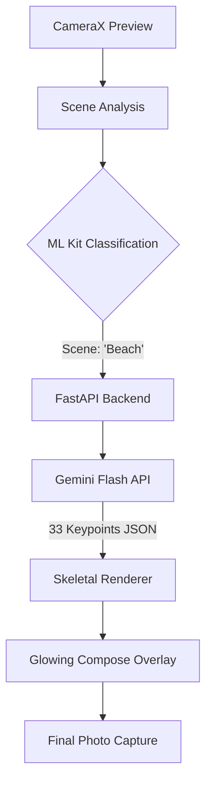

# 📸 El Foto (Context Camera)

**El Foto** is an AI-powered native Android application designed to solve "posing anxiety." Instead of awkward snapshots, El Foto analyzes your environment in real-time and provides a mathematically generated, aesthetically appropriate skeletal pose overlay directly on your camera viewfinder.

---

## ✨ Features

- **🧠 Generative Pose Direction**: Uses **Google Gemini Flash** to dynamically generate 33-point skeletal poses based on your environment.
- **👁️ On-Device Scene Intelligence**: Instantly detects your setting (Cafe, Beach, Gym, Graduation, etc.) using a local ML Kit classification engine.
- **📐 Mathematical Precision**: Renders 33 normalized anatomical keypoints on a glowing, semi-transparent Compose Canvas.
- **⚡ Zero-Lag Viewfinder**: Built with **CameraX** for a smooth 60fps preview and high-resolution captures.
- **🔒 Privacy First**: All visual analysis happens on-device; only a scene label (e.g., "Park") is sent to the cloud for pose generation.

---

## 🏗️ Technical Architecture



---

## 🚀 Getting Started

### 1. Backend (Python FastAPI)
The backend acts as the "Brain," integrating with Gemini to generate coordinates.

```bash
cd backend
python -m venv .venv
source .venv/bin/activate
pip install -r requirements.txt

# Create .env with your key
echo "GEMINI_API_KEY=your_key_here" > .env

uvicorn main:app --host 0.0.0.0 --port 8000
```

### 2. Android App (Kotlin + Jetpack Compose)
The frontend handles the "Eye" and the "Magic" rendering.

- **Emulator**: Works out of the box (points to `10.0.2.2`).
- **Physical Device**: Update `BASE_URL` in `ApiClient.kt` to your machine's local IP.

**Build Requirements:**
- JDK 17
- Android SDK 34 (Upside Down Cake)

---

## 🛠️ Tech Stack

- **Android**: Kotlin, Jetpack Compose, CameraX, ML Kit, Retrofit, Coroutines.
- **Backend**: Python 3.x, FastAPI, Google GenAI SDK (Gemini).
- **Inference**: Gemini 2.5 Flash.

---

## 📂 Project Structure

```text
├── android/ContextCamera/  # Full Android Studio project
├── backend/                # FastAPI source & requirements
└── context-camera-v1.0.apk # Pre-built debug APK
```

---

## 📄 License
This project is open-source and free to use for creative photography.
