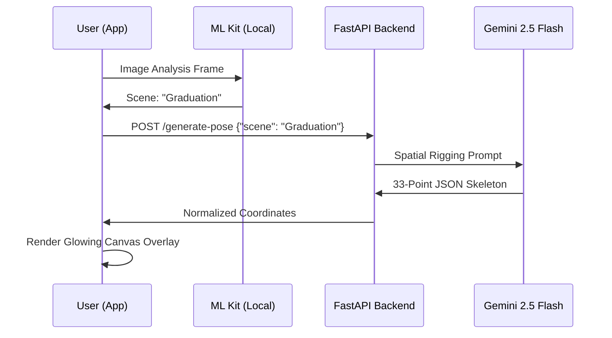

# 🌈 El Foto: Generative Context Camera
> *Solve "Posing Anxiety" with On-Device Scene Intelligence & Cloud-Powered Spatial Rigging*

[](https://kotlinlang.org) 
[](https://developer.android.com/jetpack/compose) 
[](https://fastapi.tiangolo.com) 
[](https://ai.google.dev/)

**El Foto** is a high-performance native Android application that bridges on-device computer vision with LLM-based spatial reasoning to guide subjects through the perfect pose for any environment.

---

## 📽️ The Problem vs. The Solution

**The Problem:** Most photographers aren't professional directors. Subjects often feel awkward, and "what should I do with my hands?" is the universal question that ruins great backgrounds.

**The Solution:** El Foto uses a **Hybrid Edge-Cloud Architecture**. 
1. **The Eye (ML Kit)**: Identifies the specific context local to the device.
2. **The Brain (Gemini 2.5 Flash)**: Acts as a professional rigger to generate a 33-point JSON wireframe.
3. **The Magic (Compose Canvas)**: Overlays a glowing, static guide for the subject to align with.

---

## 🛠️ Advanced Technical Architecture

### 1. On-Device Contextual Classification (Edge)
Using a customized classification engine built on **ML Kit Image Labeling**, El Foto processes a low-res buffer from the CameraX `ImageAnalysis` stream. It maps high-confidence labels to a normalized "Scene Ontology":
- `academic` + `mortarboard` ➞ **Graduation**
- `cup` + `table` + `aroma` ➞ **Cafe**
- `sand` + `ocean` ➞ **Beach**

### 2. Generative Spatial Rigging (Cloud)
The backend doesn't just return a static image. It uses a **Strict LLM Prompting Strategy** to force Gemini to return a raw BlazePose-compatible JSON array of coordinates.

```json
{
  "pose_name": "The Confident Graduate",
  "keypoints": [{"x": 0.5, "y": 0.15}, ...] 
}
```

### 3. Glow-Buffer Rendering Engine (UI)
The `PoseOverlay` utilizes a multi-pass drawing strategy:
- **Pass 1 (Diffusion)**: 18px stroke with 8% alpha for ambient glow.
- **Pass 2 (Inner Core)**: 10px stroke with 15% alpha.
- **Pass 3 (Vector)**: 4px solid stroke with 75% alpha for precise alignment.

---

## 🧬 System Flow



---

## 🏃‍♂️ Deployment Guide

### Backend: FastAPI Core
```bash
cd backend
source .venv/bin/activate
uvicorn main:app --host 0.0.0.0 --port 8000
```
*Requires `GEMINI_API_KEY` in `.env`*

### Android: Build & Sideload
1. Open in Android Studio or use CLI:
   ```bash
   export JAVA_HOME=~/jdk/jdk-17.0.12
   ./gradlew assembleDebug
   ```
2. Deploy `app-debug.apk` to any device running API 26+.

---

## 🔭 Future Scope
- **Dynamic Motion Alignment**: Use MediaPipe real-time tracking to turn the overlay green when the user successfully matches the pose.
- **Multi-Person Support**: Contextual poses for couples or groups.
- **Scene-Aware Lighting**: Suggest camera settings based on detected ambient light.

---
*Created by [Antigravity](https://google.com) for professional photography assistance.*
