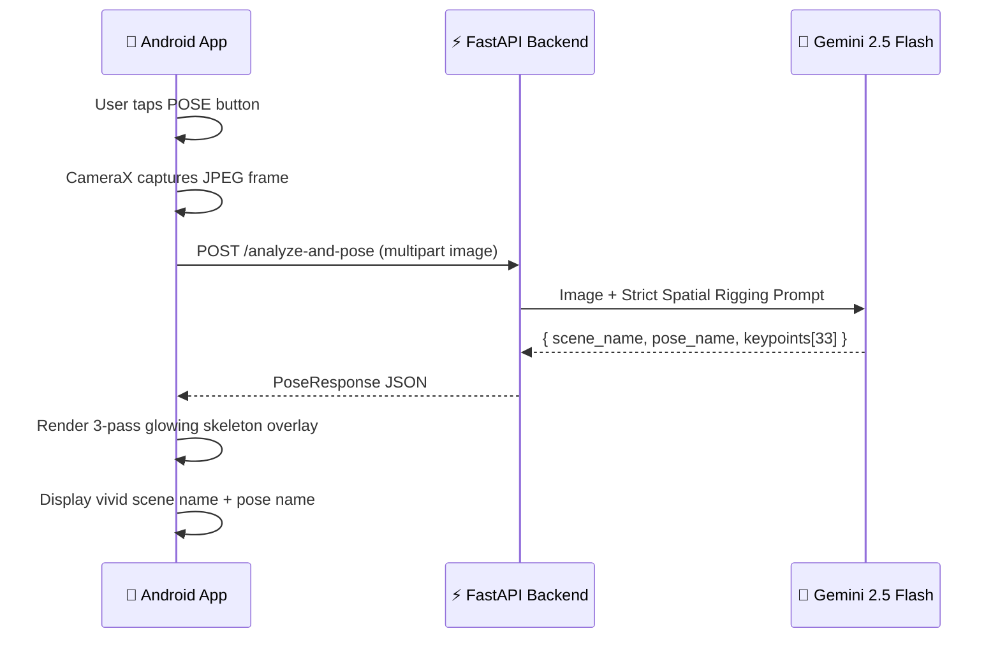

<div align="center">


<h3>AI-powered photography assistant that sees your world and directs your perfect pose</h3>

<p>
  <a href="https://kotlinlang.org"></a>
  <a href="https://developer.android.com/jetpack/compose"></a>
  <a href="https://fastapi.tiangolo.com"></a>
  <a href="https://ai.google.dev/"></a>
  
</p>

<p>
  <a href="#-problem--solution">Problem</a> •
  <a href="#-architecture">Architecture</a> •
  <a href="#-quick-start">Quick Start</a> •
  <a href="#-api-reference">API Reference</a> •
  <a href="#-tech-stack">Tech Stack</a> •
  <a href="#-roadmap">Roadmap</a>
</p>

</div>

---

## ✨ What is El Foto?

**El Foto** is a real-time AI photography assistant for Android. Point your camera at any environment — a café, a beach, a graduation hall — and it **analyzes the scene with Gemini Vision AI** and overlays a glowing, personalized pose guide directly on your camera viewfinder.

> No more *"what do I do with my hands?"* — El Foto sees your world and directs your perfect shot.

---

## 🎯 Problem & Solution

| Without El Foto | With El Foto |
|---|---|
| Subjects feel awkward in front of the camera | AI-generated pose guide takes the guesswork out |
| Generic tips don't match the environment | Pose is tailored to the *exact* scene — beach, café, forest |
| Photographers must give real-time direction | The app acts as an always-on AI photography director |
| Poses look stiff and unnatural | 33-point BlazePose skeleton ensures anatomically correct, expressive poses |

---

## 🏗️ Architecture

El Foto uses a clean **Edge → Cloud → Render** pipeline:

```
┌─────────────────┐         ┌────────────────────┐         ┌──────────────────────┐
│  Android (Edge) │──JPEG──▶│  FastAPI Backend   │──API──▶ │  Gemini 2.5 Flash    │
│                 │         │                    │         │  (Vision + Reasoning) │
│  CameraX frame  │◀──JSON──│  Pose Coordinator  │◀──JSON──│  Scene + 33 Keypoints │
│  Compose Canvas │         │                    │         │                      │
└─────────────────┘         └────────────────────┘         └──────────────────────┘
```

### 1. 📸 Frame Capture (Android)
- `CameraX ImageCapture` snaps an in-memory JPEG on user tap — **no storage permissions required**
- Frame bytes are streamed directly to the backend via `multipart/form-data`
- Front / back camera toggle via ViewModel state

### 2. 🧠 AI Scene Analysis + Pose Generation (Backend)
- Raw JPEG is uploaded to the **FastAPI** backend
- **Gemini 2.5 Flash Vision** analyzes the actual image — no keyword maps, no hardcoded labels
- Returns a vivid `scene_name` (e.g. *"sun-drenched golden beach at sunset"*) + a creative `pose_name`
- Strict prompt engineering forces exactly **33 BlazePose-compatible keypoints** as normalized coordinates

### 3. 🎨 Glow-Buffer Rendering (UI)
`PoseOverlay` draws a multi-pass skeleton on a Compose `Canvas`:

| Pass | Stroke | Alpha | Effect |
|------|--------|-------|--------|
| 1 — Diffusion | 18 px | 8% | Ambient glow halo |
| 2 — Inner Core | 10 px | 15% | Soft luminous ring |
| 3 — Vector | 4 px | 75% | Precise alignment guide |

---

## 🔄 System Flow


```mermaid
sequenceDiagram
    participant U as 📱 Android App
    participant API as ⚡ FastAPI Backend
    participant LLM as 🤖 Gemini 2.5 Flash

    U->>U: User taps POSE button
    U->>U: CameraX captures JPEG frame
    U->>API: POST /analyze-and-pose (multipart image)
    API->>LLM: Image + Strict Spatial Rigging Prompt
    LLM-->>API: { scene_name, pose_name, keypoints[33] }
    API-->>U: PoseResponse JSON
    U->>U: Render 3-pass glowing skeleton overlay
    U->>U: Display vivid scene name + pose name
```

---

## 🚀 Quick Start

### Prerequisites
- Android Studio Hedgehog (2023.1.1) or newer
- Python 3.10+
- A free [Google AI Studio](https://aistudio.google.com/) API key
- Android device or emulator with API 26+

---

### Backend Setup

```bash
# 1. Clone the repo
git clone https://github.com/Mithun141404/El-Foto.git
cd El-Foto/backend

# 2. Create and activate a virtual environment
python -m venv .venv
source .venv/bin/activate      # Windows: .venv\Scripts\activate

# 3. Install dependencies
pip install -r requirements.txt

# 4. Configure your API key
cp .env.example .env
# Open .env and set: GEMINI_API_KEY=your_key_here

# 5. Start the server
uvicorn main:app --host 0.0.0.0 --port 8000 --reload
```

The API is now live at `http://localhost:8000`.  
Visit `http://localhost:8000/docs` for the interactive Swagger UI.

---

### Android Setup

```bash
cd El-Foto/android/ContextCamera

# 1. Copy and fill in local.properties
cp local.properties.example local.properties
# Edit local.properties:
#   sdk.dir=/path/to/your/Android/Sdk
#   BACKEND_URL=http://<your-machine-ip>:8000
#   (Use 10.0.2.2:8000 for Android Emulator)

# 2. Build and install
./gradlew installDebug
```

Or open the `android/ContextCamera` folder in **Android Studio** and press **▶ Run**.

---

## 📡 API Reference

### `POST /analyze-and-pose`

Analyzes a raw camera frame with Gemini Vision and returns a scene description + 33-point pose.

**Request:** `multipart/form-data`

| Field | Type | Description |
|-------|------|-------------|
| `image` | `File` | JPEG or PNG camera frame |

**Response:** `application/json`

```json
{
  "scene_name": "sun-drenched golden beach at sunset",
  "pose_name": "The Relaxed Shoreline Lean",
  "keypoints": [
    { "x": 0.50, "y": 0.14 },
    { "x": 0.48, "y": 0.17 },
    "...33 total BlazePose keypoints (normalized 0.0–1.0)"
  ]
}
```

### `GET /health`

```json
{ "status": "ok", "version": "2.0.0", "recognition": "gemini-vision" }
```

---

## 🛠️ Tech Stack

| Layer | Technology | Role |
|-------|-----------|------|
| **Android UI** | Jetpack Compose + Material 3 | Declarative camera UI & glow skeleton overlay |
| **Camera** | CameraX | Live preview + in-memory JPEG capture |
| **Networking** | Retrofit 2 + OkHttp | Multipart image upload with 60s timeouts |
| **Backend** | FastAPI + Uvicorn | High-performance async API server |
| **AI Model** | Gemini 2.5 Flash (Vision) | Multimodal scene understanding + pose generation |
| **AI Client** | `google-generativeai` Python SDK | Multimodal content generation |
| **Config** | `local.properties` + `.env` | Secrets-free, gitignore-safe builds |

---

## 📁 Project Structure

```
El-Foto/
├── android/
│   └── ContextCamera/
│       ├── app/
│       │   ├── build.gradle.kts             # BACKEND_URL injected via BuildConfig
│       │   └── src/main/java/com/contextcamera/app/
│       │       ├── MainActivity.kt          # App entry point
│       │       ├── network/
│       │       │   ├── ApiClient.kt         # Retrofit singleton
│       │       │   ├── ApiService.kt        # API interface definition
│       │       │   └── PoseModels.kt        # Keypoint + PoseResponse models
│       │       ├── ui/
│       │       │   ├── CameraScreen.kt      # Main camera composable
│       │       │   └── PoseOverlay.kt       # 3-pass glow canvas renderer
│       │       ├── viewmodel/
│       │       │   └── CameraViewModel.kt   # UI state management
│       │       └── ml/
│       │           └── SceneClassifier.kt   # (legacy) on-device classifier
│       └── local.properties.example         # Config template — copy to local.properties
└── backend/
    ├── main.py                              # FastAPI app + Gemini Vision logic
    ├── requirements.txt                     # Python dependencies
    └── .env.example                         # Secrets template — copy to .env
```

---

## 🔭 Roadmap

- [x] Real-time Gemini Vision scene analysis (no hardcoded labels)
- [x] 33-point BlazePose skeleton overlay with 3-pass glow-buffer rendering
- [x] Front / back camera toggle
- [ ] **Dynamic Pose Matching** — Turn overlay green when user aligns with the guide (MediaPipe)
- [ ] **Multi-Person Poses** — Contextual poses for couples and groups
- [ ] **Scene-Aware Lighting Tips** — Suggest camera settings based on ambient light detection
- [ ] **Offline Mode** — On-device Gemini Nano for common scene poses

---

## 🤝 Contributing

Contributions are welcome! Please open an issue or submit a pull request.

1. Fork the repository
2. Create your feature branch: `git checkout -b feat/amazing-feature`
3. Commit your changes: `git commit -m 'feat: add amazing feature'`
4. Push to the branch: `git push origin feat/amazing-feature`
5. Open a Pull Request

---

## 📄 License

This project is open source and free to use under the [MIT License](LICENSE).

---

<div align="center">

Built with ❤️ for the **Razorpay AI Builders** hackathon

*Powered by [Google Gemini](https://ai.google.dev/) · [Jetpack Compose](https://developer.android.com/jetpack/compose) · [FastAPI](https://fastapi.tiangolo.com)*

</div>
